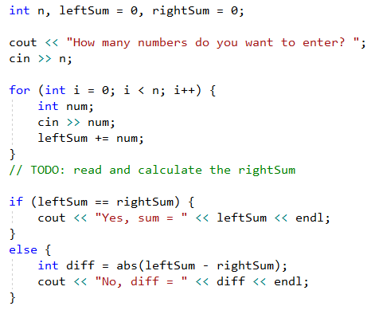

# Глава 5.1. Повторения (цикли)

В настоящата глава ще се запознаем с конструкциите за **повторение на група команди**, известни в програмирането с понятието "**цикли**". Ще напишем няколко цикъла с използване на оператора **`for`** в класическата му форма. Накрая ще решим няколко практически задачи, изискващи повторение на поредица от действия, като използваме цикли.

## Видео

<div class="video-player">
  Гледайте видео-урок по тази глава тук: <a target="_blank"
  href="https://www.youtube.com/watch?v=7D7fECmq_VQ">
  https://www.youtube.com/watch?v=7D7fECmq_VQ</a>.
</div>

## Повторения на блокове код (for цикъл)

В програмирането често пъти се налага **да изпълним блок с команди няколко пъти**. За целта се използват т.нар. **цикли**. Нека разгледаме един пример за **`for` цикъл**, който преминава последователно през числата от 1 до 10 и ги отпечатва:

```cpp
for (int i = 1; i <= 10; i++) {
  cout << "i = " << i << endl;
}
```
Може да тествате примера онлайн: https://repl.it/@vncpetrov/ForLoopExample.

Цикълът започва с **оператора `for`** и преминава през всички стойности за дадена променлива в определен интервал, например всички числа от 1 до 10 включително, и за всяка стойност изпълнява поредица от команди.

В декларацията на цикъла трябва да се зададе **начална стойност** и **крайна стойност**. **Тялото на цикъла** обикновено се огражда с къдрави скоби **`{ }`** и представлява блок с една или няколко команди. На фигурата по-долу е показана структурата на един **`for` цикъл**:


Целта на цикъла е да се премине последователно през числата 1, 2, 3, …, n и за всяко от тях да се изпълни някакво действие. В примера по-горе създаваме локалната променливата **`i`** с начална стойност 1 (**`int i = 1`**) и увеличаваме стойността на променливата с 1 (**`i++`**) всеки път, когато кодът между къдравите скоби се изпълни. Цикълът се повтаря, докато условието **`i <= 10`** е изпълнено (**`true`**). Всяко от тези повторения се нарича "**итерация**". В примера по-горе променливата **`i`** приема стойности от 1 до 10 включително и в тялото на цикъла се отпечатва текущата стойност.

### Пример: числа от 1 до 100

Да се напише програма, която **печата числата от 1 до 100**. Програмата не приема вход и отпечатва числата от 1 до 100 едно след друго, по едно на ред.

#### Насоки и подсказки

Можем да решим задачата с **`for` цикъл** , с който преминаваме с променливата **`i`** през числата от 1 до 100 и ги отпечатваме в тялото на цикъла:


**Стартираме** програмата с [**Ctrl + F5**] и я **тестваме**:


#### Тестване в Judge системата

Тествайте решението си тук: [https://judge.softuni.bg/Contests/Practice/Index/1364#0](https://judge.softuni.bg/Contests/Practice/Index/1364#0).

Трябва да получите **100 точки** (напълно коректно решение).
 
## Code Snippet за for цикъл във Visual Studio

Когато програмираме, често се налага да пишем цикли. Затова в повечето среди за разработка (IDE) има **шаблони за код** (**code snippets**) за писане на цикли. Един такъв шаблон е **шаблонът за `for` цикъл във Visual Studio**. Напишете **`for`** в редактора за C++ код във Visual Studio и **натиснете един пъти** [**Tab**]. Visual Studio ще разгъне за вас шаблон и ще напише цялостен **`for` цикъл**:


**Опитайте сами**, за да усвоите умението да ползвате шаблона за код за **`for` цикъл** във Visual Studio.

### Пример: числа до 1000, завършващи на 7

Да се напише програма, която намира всички числа в интервала [**1 … 1000**], които завършват на 7. 

#### Насоки и подсказки

Задачата можем да решим като комбинираме **`for` цикъл** за преминаваме през числата от 1 до 1000 и **проверка** за всяко число дали завършва на 7. Има и други решения, разбира се, но нека решим задачата чрез **завъртане на цикъл + проверка**:


#### Тестване в Judge системата

Тествайте решението си тук: [https://judge.softuni.bg/Contests/Practice/Index/1364#1](https://judge.softuni.bg/Contests/Practice/Index/1364#1).


### Пример: всички латински букви

Да се напише програма, която отпечатва буквите от латинската азбука: **a, b, c, …, z**.
    
#### Насоки и подсказки

Символите в C++ биват запазени в паметта като числа. За конвертирането им от число в символ и обратно се използва така наречената **ASCII таблица**. Например символът **`а`** (малко "а") се запазва в компютърната памет като числото 97, а **`z`** (малко "z") - като 122. Това означава, че можем да създадем цикъл, който използва тип данни **`char`**, и да променяме символа, като увеличаваме числото, което му съответства:


#### Тестване в Judge системата

Тествайте решението си тук: [https://judge.softuni.bg/Contests/Practice/Index/1364#2](https://judge.softuni.bg/Contests/Practice/Index/1364#2).
 
### Пример: събиране на числа

Да се напише програма, която **въвежда `n` цели числа и ги събира**.

* От първия ред на входа се въвежда броят числа **`n`**.
* От следващите **`n`** реда се въвежда по едно число.
* Числата се събират и накрая се отпечатва резултатът.

#### Примерен вход и изход

|              Вход             | Изход |              Вход             | Изход |
|-------------------------------|-------|-------------------------------|-------|
| 2<br>10<br>20                 | 30    | 1<br>999                      | 999   | 
| 3<br>-10<br>-20<br>-30        | -60   | 0                             | 0     |

#### Насоки и подсказки

Можем да решим задачата за събиране на числа по следния начин:
 - Четем входното число **`n`** от конзолата.
 - Започваме първоначално със сбор **`sum = 0`**.
 - Създаваме цикъл от 0 до **`n`**. На всяка итерация от цикъла четем число **`num`** и го добавяме към сумата **`sum`**.
 - Накрая отпечатваме полученият сбор **`sum`**.
 
Ето и сорс код на описаната идея:


#### Тестване в Judge системата

Тествайте решението си тук: [https://judge.softuni.bg/Contests/Practice/Index/1364#3](https://judge.softuni.bg/Contests/Practice/Index/1364#3).


### Пример: най-голямо число

Да се напише програма, която въвежда **n цели числа** (**n** > 0), намира и отпечатва **най-голямото** измежду тях. На първия ред на входа се въвежда броят числа **n**. След това се въвеждат самите числа, по едно на ред. Примери:

#### Примерен вход и изход

|               Вход            |    Изход    |               Вход            |    Изход    |
|-------------------------------|-------------|-------------------------------|-------------|
| 2<br>100<br>99                | 100         | 4<br>45<br>-20<br>7<br>99<br> | 99          |  
| 3<br>-10<br>20<br>-30         | 20          | 2<br>-1<br>-2                 | -1          | 

#### Насоки и подсказки

Можем да решим задачата за най-голямо число по следния начин:
 - Въвеждат се броят числа **`n`**.
 - Ще прочетем първото число отделно и ще инициализираме променливата **`max`** със стойността му, за да можем да сравняваме следващите числа с нея.
 - Създаваме цикъл започващ от 1 (за да прескочим първото число, което прочетохме отделно) до **`n`**.
 - На всяка стъпка прочитаме число и проверяваме дали  то е по-голямо от последното открито най-голямо (т.е. променливата **`max`**) и ако е - запазваме стойността му в промеливата **`max`**.
 - Накрая отпечатваме променливата, в която пазим най-голямото число.


#### Тестване в Judge системата

Тествайте решението си тук: [https://judge.softuni.bg/Contests/Practice/Index/1364#4](https://judge.softuni.bg/Contests/Practice/Index/1364#4).
 
### Пример: най-малко число

Да се напише програма, която въвежда **n цели числа** (**n** > 0) и намира **най-малкото** измежду тях. Първо се въвежда броя числа **n**, след тях още **n** числа по едно на ред. 

#### Примерен вход и изход

|               Вход            | Изход | 
|-------------------------------|-------|
| 2<br>100<br>99                | 99    |
| 3<br>-10<br>20<br>-30         | -30   |
| 4<br>45<br>-20<br>7<br>99<br> | -20   |

#### Насоки и подсказки

Задачата е абсолютно аналогична с предходната, само че с различен знак за проверка:


#### Тестване в Judge системата

Тествайте решението си тук: [https://judge.softuni.bg/Contests/Practice/Index/1364#5](https://judge.softuni.bg/Contests/Practice/Index/1364#5).
 
### Пример: ляв и дясен сбор

Да се напише програма, която въвежда **2 \* n цели числа** и проверява дали **сборът на първите n числа** (ляв сбор) е равен на **сбора на вторите n числа** (десен сбор). При равенство се отпечатва **"Yes" + сбора**, иначе се отпечатва **"No" + разликата**. Разликата се изчислява, като положително число (по абсолютна стойност). Форматът на изхода трябва да е като в примерите по-долу.	

#### Примерен вход и изход

|             Вход          |      Изход     |           Вход           |     Изход    |
| ------------------------- | -------------- | ------------------------ | ------------ | 
| 2<br>10<br>90<br>60<br>40 | Yes, sum = 100 | 2<br>90<br>9<br>50<br>50 | No, diff = 1 |

#### Насоки и подсказки

Първо въвеждаме числото **n**, след това първите **n** числа (**лявата** половина) и ги събираме. Продължаваме с въвеждането на още **n** числа (**дясната** половина) и намираме и техния сбор. Изчисляваме **разликата** между намерените сборове по абсолютна стойност: **`abs(leftSum - rightSum)`**. Ако разликата е **0**, отпечатваме **"Yes, sum = " + сбора**, в противен случай - отпечатваме **"No, diff = " + разликата**:



#### Тестване в Judge системата

Тествайте решението си тук: [https://judge.softuni.bg/Contests/Practice/Index/1364#6](https://judge.softuni.bg/Contests/Practice/Index/1364#6).
 
### Пример: четен / нечетен сбор

Да се напише програма, която въвежда **n цели числа** и проверява дали **сборът на числата на четни позиции** е равен на **сбора на числата на нечетни позиции**. При равенство отпечатва **"Yes" + сбора**, в противен случай отпечатва **"No" + разликата**. Разликата се изчислява по абсолютна стойност. Форматът на изхода трябва да е като в примерите по-долу.

#### Примерен вход и изход

|            Вход           |        Изход      |
| ------------------------- | ----------------- |
| 4<br>10<br>50<br>60<br>20 | Yes<br>Sum = 70   |
| 4<br>3<br>5<br>1<br>-2    | No<br>Diff = 1    |
| 3<br>5<br>8<br>1          | No<br>Diff = 2    |

#### Насоки и подсказки

Въвеждаме числата едно по едно и изчисляваме двата **сбора** (на числата на **четни** позиции и на числата на **нечетни** позиции). Както в предходната задача - изчисляваме абсолютната стойност на разликата и отпечатваме резултата (**"Yes" + сбора** при разлика 0 или **"No" + разликата** в противен случай):


#### Тестване в Judge системата

Тествайте решението си тук: [https://judge.softuni.bg/Contests/Practice/Index/1364#7](https://judge.softuni.bg/Contests/Practice/Index/1364#7).
 
### Пример: събиране на гласните букви

Да се напише програма, която въвежда **текст** (стринг), изчислява и отпечатва **сбора от стойностите на гласните букви** според таблицата по-долу:

|   a   |   e   |   i   |   o   |   u   | 
| :---: | :---: | :---: | :---: | :---: |
| 1     | 2     | 3     | 4     | 5     |

#### Примерен вход и изход

| Вход  |         Изход        |  Вход  |           Изход          | 
| ----- | -------------------- | ------ | ------------------------ |
| hello | 6<br>(e+o = 2+4 = 6) | bamboo | 9<br>(a+o+o = 1+4+4 = 9) |
| hi    | 3<br>(i = 3)         | beer   | 4<br>(e+e = 2+2 = 4)     |

#### Насоки и подсказки

Прочитаме входния текст **`text`**, инициализираме променлива за сбора и създаваме цикъл, който преминава през всеки символ от входния текст (от **0** до **`text.length()`**). Обхождаме въведените символи, като проверяваме дали текущия символ (**`text[i]`**) е гласна буква и ако е - добавяме съответното число към сбора:


#### Тестване в Judge системата

Тествайте решението си тук: [https://judge.softuni.bg/Contests/Practice/Index/1364#8](https://judge.softuni.bg/Contests/Practice/Index/1364#8).
 
## Какво научихме от тази глава?

Можем да повтаряме блок код с **`for` цикъл**:


Можем да четем поредица от **`n`** числа от конзолата:


## Упражнения: повторения (цикли)

След като се запознахме с циклите, идва време **да затвърдим знанията си на практика**, а както знаете, това става с много писане на код. Да решим няколко задачи за упражнение.

### Празно Visual Studio решение (Blank Solution)

Създаваме празно решение **(Blank Solution)** във Visual Studio, за да организираме по-добре задачите за упражнение. Целта на този **Blank Solution** e да съдържа **по един проект за всяка задача** от упражненията:
  


Задаваме **да се стартира по подразбиране текущият проект** (не първият в решението). Кликваме с десен бутон на мишката върху [**Solution 'Loops'**] -> [**Set StartUp Projects…**] -> [**Current selection**].

### Задача: елемент, равен на сбора на останалите

Да се напише програма, която въвежда **n цели числа** и проверява дали сред тях съществува число, което е равно на сбора на всички останали. Ако има такъв елемент, се отпечатва **"Yes Sum = " + неговата стойност**, в противен случай - **"No Diff = " + разликата между най-големия елемент и сбора на останалите** (по абсолютна стойност). 

#### Примерен вход и изход

|                  Вход                  |      Изход      |            Коментар           |
| -------------------------------------- | --------------- | :---------------------------: |
| 7<br>3<br>4<br>1<br>1<br>2<br>12<br>1  | Yes Sum = 12    | 3 + 4 + 1 + 2 + 1 + 1 = 12    |
| 4<br>6<br>1<br>2<br>3                  | Yes Sum = 6     | 1 + 2 + 3 = 6                 |
| 3<br>1<br>1<br>10                      | No Diff = 8     | &#124;10 - (1 + 1)&#124; = 8  |
| 3<br>5<br>5<br>1                       | No Diff = 1     | &#124;5 - (5 + 1)&#124; = 1   |
| 3<br>1<br>1<br>1                       | No Diff = 1     | -                             |

#### Насоки и подсказки

Трябва да изчислим **сбора** на всички елементи, да намерим **най-големия** от тях и да проверим търсеното условие.

#### Тестване в Judge системата

Тествайте решението си тук: [https://judge.softuni.bg/Contests/Practice/Index/1364#9](https://judge.softuni.bg/Contests/Practice/Index/1364#9).
 
### Задача: четни / нечетни позиции

Напишете програма, която чете **n числа** и пресмята **сбора**, **минимума** и **максимума** на числата на **четни** и **нечетни** позиции (броим от 1). Когато няма минимален / максимален елемент, отпечатайте **"No"**. 

#### Примерен вход и изход

| Вход | Изход | Вход | Изход |
| ---- | ----- | ---- | ----- |
| 6<br>2<br>3<br>5<br>4<br>2<br>1 | OddSum=9,<br>OddMin=2,<br>OddMax=5,<br>EvenSum=8,<br>EvenMin=1,<br>EvenMax=4 | 2<br>1.5<br>-2.5 | OddSum=1.5,<br>OddMin=1.5,<br>OddMax=1.5,<br>EvenSum=-2.5,<br>EvenMin=-2.5,<br>EvenMax=-2.5 |
| 1<br>1 | OddSum=1,<br>OddMin=1,<br>OddMax=1,<br>EvenSum=0,<br>EvenMin=No,<br>EvenMax=No | 0 | OddSum=0,<br>OddMin=No,<br>OddMax=No,<br>EvenSum=0,<br>EvenMin=No,<br>EvenMax=No |
| 5<br>3<br>-2<br>8<br>11<br>-3 | OddSum=8,<br>OddMin=-3,<br>OddMax=8,<br>EvenSum=9,<br>EvenMin=-2,<br>EvenMax=11 | 4<br>1.5<br>1.75<br>1.5<br>1.75 | OddSum=3,<br>OddMin=1.5,<br>OddMax=1.5,<br>EvenSum=3.5,<br>EvenMin=1.75,<br>EvenMax=1.75 |
| 1<br>-5 | OddSum=-5,<br>OddMin=-5,<br>OddMax=-5,<br>EvenSum=0,<br>EvenMin=No,<br>EvenMax=No | 3<br>-1<br>-2<br>-3 | OddSum=-4,<br>OddMin=-3,<br>OddMax=-1,<br>EvenSum=-2,<br>EvenMin=-2,<br>EvenMax=-2 |

#### Насоки и подсказки

Задачата обединява няколко предходни задачи: намиране на **минимум**, **максимум** и **сбор**, както и обработка на елементите от **четни и нечетни позиции**. Припомнете си ги.

В тази задача е по-добре да се работи с **дробни числа** (не цели). Сборът, минимумът и максимумът също са дробни числа.

#### Тестване в Judge системата

Тествайте решението си тук: [https://judge.softuni.bg/Contests/Practice/Index/1364#10](https://judge.softuni.bg/Contests/Practice/Index/1364#10).
 
### Задача: еднакви двойки

Дадени са **2 \* n числа**. Първото и второто формират **двойка**, третото и четвъртото също и т.н. Всяка двойка има **стойност** – сбора от съставящите я числа. Напишете програма, която проверява **дали всички двойки имат еднаква стойност**.

В случай, че стойността е еднаква, отпечатайте **"Yes, value=…" + стойността**, в противен случай отпечатайте **максималната разлика** между две последователни двойки в следния формат - **"No, maxdiff=…" + максималната разлика**. 

Входът се състои от число **n**, следвано от **2\*n цели числа**, всички по едно на ред.


#### Примерен вход и изход

|                   Вход                    |     Изход     |                                 Коментар                             |
| ----------------------------------------- | ------------- | :------------------------------------------------------------------: | 
| 3<br>1<br>2<br>0<br>3<br>4<br>-1          | Yes, value=3  | стойности = {3, 3, 3}<br>еднакви стойности                           | 
| 2<br>1<br>2<br>2<br>2                     | No, maxdiff=1 | стойности = {3, 4}<br>разлики = {1}<br>макс. разлика = 1             |
| 4<br>1<br>1<br>3<br>1<br>2<br>2<br>0<br>0 | No, maxdiff=4 | стойности = {2, 4, 4, 0}<br>разлики = {2, 0, 4}<br>макс. разлика = 4 |
| 1<br>5<br>5                               | Yes, value=10 | стойности = {10}<br>една стойност<br>еднакви стойности               |
| 2<br>-1<br>0<br>0<br>-1                   | Yes, value=-1 | стойности = {-1, -1}<br>еднакви стойности                            | 
| 2<br>-1<br>2<br>0<br>-1                   |  No, maxdiff=2| стойности = {1, -1}<br>разлики = {2}<br>макс. разлика = 2            |

#### Насоки и подсказки

Прочитаме входните числа **по двойки**. За всяка двойка пресмятаме **сбора** ѝ. Докато четем входните двойки, за всяка двойка, без първата, трябва да пресметнем **разликата с предходната**. За целта е необходимо да пазим в отделна променлива сбора на предходната двойка. Накрая намираме **най-голямата разлика** между две двойки. Ако е **0**, отпечатваме **"Yes, value="** + стойността, в противен случай - **"No, maxdiff="** + разликата.

#### Тестване в Judge системата

Тествайте решението си тук: [https://judge.softuni.bg/Contests/Practice/Index/1364#11](https://judge.softuni.bg/Contests/Practice/Index/1364#11).

Ако имате проблеми с задачите по-горе, **гледайте видеото** в началото на тази глава. Там са обяснени повечето от тях, на живо и стъпка по стъпка. Или питайте във **форума на СофтУни**: https://softuni.bg/forum.
